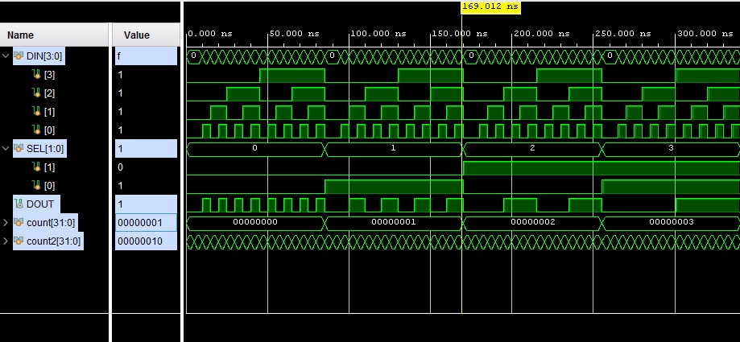

# 4 to 1 Multiplexer

This 4 to 1 multiplexer has two inputs, **DIN** [3:0] and **SEL** [1:0], and one output as **DOUT** [1:0].

# Simulation

The screenshot shows the simulation of the 4 to 1 mux design.
\
\

**Test bench** (mux_4_to_1_TB.v) has been provided to simulate and verify the design.

